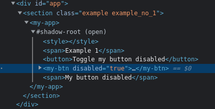

# web-component, branch "main"

В данном репозитории находится api, позволяющий вам создавать ui-элементы, используя веб-компоненты. Он написан на языке `TypeScript` и расположен в каталоге `/src/core/web-component`. Вы можете познакомиться с примером его использования, перейдя по [ссылке](https://github.com/EranosyanEduard/web-component-core/tree/example).

## Описание API

### Определение веб-компонента

```ts
import { Decorator, html, WebComponent } from 'core/web-component'

@Decorator.comp({
  name: 'my-component',
  shadow: {
    mode: 'open'
  }
})
class MyComponent extends HTMLElement implements WebComponent {
  render(): ReturnType<typeof html> {
    return html`<div><slot></slot></div>`
  }
}

export default MyComponent
```

Обратите внимание, что обязательным условием определения веб-компонента является наследование от встроенного класса `HTMLElement`, которое предусмотрено спецификацией. Кроме того, необходимо реализовать интерфейс, представленный абстрактным классом `WebComponent`. Единственным полем данного класса, требующим реализации, является поле `render` функционального типа `() => ReturnType<typeof html>`.

### Декораторы

"Пространство имен" `Decorator` содержит декораторы, т.е. функции, дополняющие функциональность веб-компонентов.

- `comp`

  назначение: определение веб-компонента;

  ```ts
  /**
   * @description
   * Параметр декоратора **comp**.
   */
  interface Param {
    whenDefined?: (promise: ReturnType<typeof customElements['whenDefined']>) => void

    /**
     * @description
     * Название веб-компонента. Требования: нижний регистр, kebab case.
     */
    name: string

    /**
     * @description
     * Опции shadow DOM. По умолчанию null.
     */
    shadow?: ShadowRootInit
  }
  ```

- `attr`

  назначение: передача данных от родителя к потомку;

  ```ts
  /**
   * @description
   * Параметр декоратора **attr**.
   */
  interface Param<Value, Context extends HTMLElement> {
    /**
     * @description
     * Функция сравнения следующего и предыдущего значений. В случае, если
     * результатом вызова функции является значение false происходит перерендер
     * веб-компонента, т.е. повторный вызов метода **render**. По умолчанию
     * сравнение значений выполняется с помощью оператора "===".
     */
    compare?: (this: Context, next: Value, prev: Value) => boolean

    /**
     * @description
     * Функция, вызов которой происходит при изменении значения.
     */
    observe?: (this: Context, next: Value, prev: Value) => void

    /**
     * @description
     * Функция валидации следующего значения. В случае, если результатом вызова
     * функции является значение false, значение отклоняется и ничего не
     * происходит. По умолчанию всегда возвращает true.
     */
    validate?: (val: Value) => boolean

    /**
     * @description
     * Функция преобразования значения из свойства в атрибут и обратно. В случае,
     * если значение является функцией, объектом или null оно кешируется и
     * значение атрибута не имеет значения. По умолчанию string.
     */
    converter?:
      | 'boolean'
      | 'number'
      | 'object'
      | 'string'
      | {
          toAttr: (value: Value) => string
          toProp: (value: string) => Value
        }

    /**
     * @description
     * Название атрибута. По умолчанию используется название свойства,
     * преобразованное в kebab case.
     * @example
     * ---------|---------|
     * Свойство | Атрибут |
     * ---------|---------|
     * foo      | foo     |
     * ---------|---------|
     * fooBar   | foo-bar |
     * ---------|---------|
     */
    name?: string

    /**
     * @description
     * Свойство, указывающее на необходимость спровоцировать событие при
     * изменении значения. Название события - "sync:<attribute name>", полезная
     * нагрузка - новое значение.
     */
    sync?: boolean
  }
  ```

  пример:

  ```ts
  // Btn.comp.ts
  import { Decorator, html, WebComponent } from 'core/web-component'

  @Decorator.comp({
    name: 'my-btn',
    shadow: {
      mode: 'open'
    }
  })
  class Btn extends HTMLElement implements WebComponent {
    @Decorator.attr<boolean, Btn>({ converter: 'boolean' })
    disabled = false

    render(): ReturnType<typeof html> {
      return html`
        <button disabled=${this.disabled}>
          <slot></slot>
        </button>
      `
    }
  }

  export default Btn
  ```

  ```ts
  // App.comp.ts
  import { Decorator, html, WebComponent } from 'core/web-component'

  @Decorator.comp({
    name: 'my-app',
    shadow: {
      mode: 'open'
    }
  })
  class App extends HTMLElement implements WebComponent {
    #btnDisabled = true

    render(): ReturnType<typeof html> {
      return html` <my-btn disabled=${this.#btnDisabled}>My button</my-btn> `
    }
  }

  export default App
  ```

  Данный пример демонстрирует определение наблюдаемого атрибута в компоненте `Btn` с помощью декоратора `attr`. В качестве значения по умолчанию используется значение `false`, а конвертера - `'boolean'`, который преобразует значение из логического в строку и обратно.

  Кроме того, для определения наблюдаемых атрибутов (en. "observed attributes") вам также доступен интерфейс, предусмотренный спецификацией:

  ```ts
  // Btn.comp.ts
  import { Decorator, html, WebComponent } from 'core/web-component'

  @Decorator.comp({
    name: 'my-component',
    shadow: {
      mode: 'open'
    }
  })
  class MyComponent extends HTMLElement implements WebComponent {
    static get observedAttributes(): Array<string> {
      return ['my-attr']
    }

    attributeChangedCallback(attr: string, prev: string | null, next: string | null) {
      switch (attr) {
        case 'my-attr':
          // do something
          break
        default:
        // do default
      }
    }

    render(): ReturnType<typeof html> {
      return html`<div><slot></slot></div>`
    }
  }

  export default MyComponent
  ```

- `prop`

  назначение: передача данных от родителя к потомку;

  ```ts
  /**
   * @description
   * Параметр декоратора **prop**.
   */
  interface Param<Value, Context extends HTMLElement> {
    /**
     * @description
     * Функция сравнения следующего и предыдущего значений. В случае, если
     * результатом вызова функции является значение false происходит перерендер
     * веб-компонента, т.е. повторный вызов метода **render**. По умолчанию
     * сравнение значений выполняется с помощью оператора "===".
     */
    compare: (this: Context, next: Value, prev: Value) => boolean

    /**
     * @description
     * Функция, вызов которой происходит при изменении значения.
     */
    observe: (this: Context, next: Value, prev: Value) => void
  }
  ```

  пример:

  ```ts
  // Btn.comp.ts
  import { Decorator, html, WebComponent } from 'core/web-component'

  @Decorator.comp({
    name: 'my-btn',
    shadow: {
      mode: 'open'
    }
  })
  class Btn extends HTMLElement implements WebComponent {
    @Decorator.attr<boolean, Btn>({ converter: 'boolean' })
    disabled = false

    render(): ReturnType<typeof html> {
      return html`
        <button disabled=${this.disabled}>
          <slot></slot>
        </button>
      `
    }
  }

  export default Btn
  ```

  ```ts
  // App.comp.ts
  import { Decorator, html, WebComponent } from 'core/web-component'

  @Decorator.comp({
    name: 'my-app',
    shadow: {
      mode: 'open'
    }
  })
  class App extends HTMLElement implements WebComponent {
    @Decorator.prop<boolean, App>()
    private _btnDisabled = true

    render(): ReturnType<typeof html> {
      return html`
        <button onclick=${this.#toggleMyBtnState}>Toggle my-btn state</button>
        <my-btn disabled=${this._btnDisabled}>My button</my-btn>
      `
    }

    #toggleMyBtnState(): void {
      this._btnDisabled = !this._btnDisabled
    }
  }

  export default App
  ```

  **Примечание**: сходство свойств веб-компонента, отмеченных декораторами `attr` и `prop`, заключается в том, что их назначением является передача значения от родителя к потомку, а его изменение "провоцирует" повторный рендер, обеспечивая реактивность. Разница же заключается в том, что 1-ые предусмотрены спецификацией веб-компонентов и "отражаются" непосредственно в атрибуты (см. screenshot):

  

- `emit`

  назначение: передача данных от потомка к родителю;

  ```ts
  /**
   * @description
   * Параметр декоратора **emit**.
   */
  interface Param {
    /**
     * @description
     * Название события. По умолчанию используется название свойства,
     * преобразованное в kebab case.
     */
    event: string
  }
  ```

  пример:

  ```ts
  // Btn.comp.ts
  import { Decorator, html, WebComponent } from 'core/web-component'

  @Decorator.comp({
    name: 'my-btn',
    shadow: {
      mode: 'open'
    }
  })
  class Btn extends HTMLElement implements WebComponent {
    #totalClick = 0

    render(): ReturnType<typeof html> {
      return html`
        <button onclick=${this._onClick}>
          <slot></slot>
        </button>
      `
    }

    @Decorator.emit({ event: 'count' })
    private _onClick(evt: MouseEvent): number {
      evt.stopPropagation()
      return ++this.#totalClick
    }
  }

  export default Btn
  ```

  ```ts
  // App.comp.ts
  import { Decorator, html, WebComponent } from 'core/web-component'

  @Decorator.comp({
    name: 'my-app',
    shadow: {
      mode: 'open'
    }
  })
  class App extends HTMLElement implements WebComponent {
    @Decorator.prop<number, App>()
    private _totalClick = 0

    render(): ReturnType<typeof html> {
      return html/* html */ `
        <my-btn oncount=${this.#setTotalClick}>My button</my-btn>
        <span>${this._totalClick}</span>
      `
    }

    #setTotalClick(evt: CustomEvent<number>): void {
      this._totalClick = evt.detail
    }
  }

  export default App
  ```

  При вызове декорируемого метода `_onClick` декоратор `emit` создаст и запустит пользовательское событие `count`, используя в качестве полезной нагрузки значение, которое возвращает такой метод, т.е. `число`.

- `style`

  назначение: стилизация веб-компонента;

  ```ts
  /**
   * @description
   * Параметр декоратора **style**.
   */
  interface Param {
    /**
     * @description
     * Массив зависимостей. Под зависимостями имеются ввиду названия наблюдаемых
     * атрибутов и свойств веб-компонента, при изменении значений которых будет
     * происходить "обновление" стилей. При отсутствии зависимостей стили
     * вычисляются однажды. По умолчанию пустой массив.
     */
    deps: string[]
  }
  ```

  ```ts
  // Btn.comp.ts
  import { Decorator, html, Style, WebComponent } from 'core/web-component'

  @Decorator.comp({
    name: 'my-btn',
    shadow: {
      mode: 'open'
    }
  })
  class Btn extends HTMLElement implements WebComponent {
    @Decorator.attr<boolean, Btn>({ converter: 'boolean' })
    disabled = false

    @Decorator.style()
    private readonly _staticStyle: Style = () => {
      const sizes = ['height', 'width'].map((prop) => `${prop}: 50px;`).join(' ')
      return `button { color: white; ${sizes} }`
    }

    @Decorator.style({ deps: ['disabled'] })
    private readonly _bgStyle: Style = () => {
      return `button { background: ${this.disabled ? 'red' : 'green'}; }`
    }

    render(): ReturnType<typeof html> {
      return html`
        <button disabled=${this.disabled}>
          <slot></slot>
        </button>
      `
    }
  }

  export default Btn
  ```

  ```ts
  // App.comp.ts
  import { Decorator, html, WebComponent } from 'core/web-component'

  @Decorator.comp({
    name: 'my-app',
    shadow: {
      mode: 'open'
    }
  })
  class App extends HTMLElement implements WebComponent {
    @Decorator.prop<boolean, App>()
    private _btnDisabled = true

    render(): ReturnType<typeof html> {
      return html`
        <button onclick=${this.#toggleMyBtnState}>Toggle my-btn state</button>
        <my-btn disabled=${this._btnDisabled}>My button</my-btn>
      `
    }

    #toggleMyBtnState(): void {
      this._btnDisabled = !this._btnDisabled
    }
  }

  export default App
  ```

  Обратите внимание на то, что для корректной работы декоратора `style` он должен декорировать свойство, значение которого соответствует функциональному типу `Style`. Таких свойств может быть произвольное количество.

- `elem`

  назначение: непосредственный доступ к DOM-элементу;

  ```ts
  /**
   * @description
   * Параметр декоратора **elem**.
   */
  interface Param {
    /**
     * @description
     * Селектор DOM-элемента.
     */
    selector: string
  }
  ```

  ```ts
  // App.comp.ts
  import { Decorator, html, WebComponent } from 'core/web-component'

  @Decorator.comp({
    name: 'my-app',
    shadow: {
      mode: 'open'
    }
  })
  class App extends HTMLElement implements WebComponent {
    @Decorator.elem({ selector: '#second' })
    private _span: HTMLSpanElement | null = null

    #intervalID = NaN

    render(): ReturnType<typeof html> {
      return html`<span id="second">0</span><span>sec</span>`
    }

    connectedCallback(): void {
      if (this._span !== null) {
        const el = this._span
        this.#intervalID = setInterval(() => {
          el.innerText = `${parseInt(el.innerText) + 1}`
        }, 1000)
      }
    }

    disconnectedCallback(): void {
      if (!Number.isNaN(this.#intervalID)) {
        clearInterval(this.#intervalID)
      }
    }
  }

  export default App
  ```

  В случае, если по заданному селектору не удалось найти DOM-элемент, то свойству будет присвоено значение `null`.

### Жизненный цикл

В качестве методов жизненного цикла спецификация веб-компонентов предлагает методы, каждый из которых имеет аналог в популярном web-framework-е:

- `constructor`

- `attributeChangedCallback: (name: string, prev: string | null, next: string | null) => void`

  Данный метод является аналогом методов `updated` / `componentDidUpdate` и используется в связке со свойством `static get observedAttributes(): Array<string>`. В качестве альтернативы я предлагаю вам использовать декоратор `attr` и опцию его параметра `observe`.

- `connectedCallback: () => void`

  Данный метод является аналогом методов `mounted` / `componentDidMount`.

- `disconnectedCallback: () => void`

  Данный метод является аналогом методов `beforeUnmount` / `componentWillUnmount`.

Каждый из этих методов будет использоваться классом, созданным с помощью декоратора `comp`, в соответствующий момент жизни веб-компонента.
